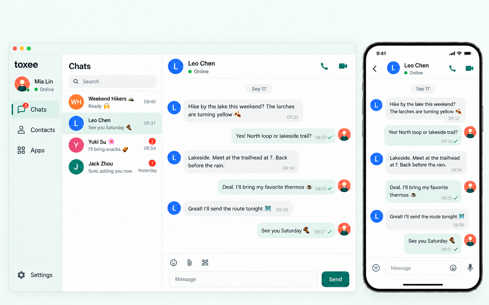

[简体中文](./README.zh-CN.md)

# toxee interface style proposals

Date: 2026-10-01. Status: implemented in Flutter. See the [implementation record](./implementation.zh-CN.md) for validation and widget renders.

All concept images now omit the external top heading, subtitle, and marketing slogans, including the historical boards and English product image. The localized README and product-page assets are synchronized; prompts and file hashes are in [header-removal.json](./header-removal.json).

Following morsecq's multiple-style approach, these proposals add four visual directions while retaining the existing Classic Blue default. The images are concepts generated with the built-in imagegen tool, not running application screenshots or exact implementation specifications.

The existing layout and interactions have also been examined. The [Chinese audit](./layout-interaction-audit.zh-CN.md) contains eight prioritized findings, source locations, before/after recommendations and acceptance criteria. Priorities include preserving failed friend requests for retry, complete button hit areas, capacity in tablet and narrow desktop layouts, an expanding composer, settings organization, readable secondary text and appearance save feedback. These improvements should be shared by all four new styles and Classic Blue. The approved improvements are now implemented; the implementation record documents current behavior.

Following feedback about overlap with Quiet Modern, Fresh Cartoon has been revised into a light comic direction: apricot and cream surfaces, coral/lavender bubbles, ink-purple contours, pill selections and restrained crisp offset shadows. Quiet Modern retains its visual direction. The [revision notes](./cartoon-v2.zh-CN.md) document the distinction; earlier versions remain as history with their external lettering removed, while this page shows the active versioned candidates.

| Option | Visual language | Geometry and typography |
| --- | --- | --- |
| Classic Blue | Existing blue, white and gray | Existing component rules |
| A · Quiet Modern | White, gray-green and deep teal | Medium corners, compact list and clear spacing |
| B · Night Link | Navy-gray, mint and restrained amber | Small corners, structural lines, monospace timestamps |
| C · Paper Correspondence | Paper-white, ink and terracotta | Flat rules, squared panels and editorial headings |
| D · Fresh Cartoon v2 | Apricot, cream, coral, lavender and ink-purple | Comic contours, pill selections and crisp offset shadows |

Quiet Modern is the recommended additional everyday style. The original four boards use the same existing 陈亮 hiking conversation for a fair comparison. The selected Quiet Modern board below has been localized into English for the English README and product-page introduction; the other comparison boards retain their original Chinese copy. Night Link is shown dark; the others are shown light. Style and brightness remain independent.

## Concept boards

## Shared product structure

The audit proposes a compact 72px navigation rail and a 280–300px conversation list at intermediate widths, a composer that grows with its content, and directly accessible appearance settings. Candidate dimensions require actual Flutter layout checks; the existing concept boards do not illustrate every proposed adjustment. Existing layout, persistence and application-detail tests passed: 49 tests in total. One existing test reproduces the failed-request removal and currently asserts that removal as expected behavior; its assertion needs to change with the fix. Runtime observation was limited to the macOS login page; authenticated flows were inspected in source and historical screenshots.

- Retain the four destinations: Chats, Contacts, Applications and Settings. Groups remain within the existing chat/contact flows.
- Desktop retains navigation, conversation list and chat columns, including safe spacing around native window controls.
- Phone chat and appearance pages are pushed screens with a back action; they do not repeat the main bottom navigation.
- Preserve presence text plus a dot, existing voice/video call actions, timestamps, attachments, emoji, voice input and actual message states. Available actions remain subject to the existing contact/group/IRC capabilities.
- Personal avatars remain circular; group avatars use rounded squares. Unread counts use numbers and selections use a check, border or indicator.
- The single check on a concept bubble illustrates delivery only. Implementation must map existing pending, failed, delivered and read states honestly.
- Use the cartoon character only in empty states or appearance thumbnails, without decorations inside normal history or new reward mechanics.

## Appearance behavior

Keep Settings → Appearance and the existing language setting. Offer five style cards and a separate System / Light / Dark selector. Every style supports both brightness modes.

Selections change only a local preview. Apply persists the preference successfully before updating both Material and UIKit; disable repeated actions while saving. On failure retain the prior global appearance, keep the pending selection and offer retry. Restore Default stages Classic Blue plus System and still requires Apply. Leaving without applying discards pending changes.

Store style and brightness per device, independently of account switching. Preserve routes, selected chats, drafts, scroll position, recording/calls and file transfers. Language retains its existing settings flow. Desktop places preview beside choices; phones stack them and allow scrolling for larger text or shorter screens while keeping Apply reachable.

## Tokens and accessibility

[style-spec.json](./style-spec.json) defines proposed light/dark semantic colors, corner radii and typography; [contrast-checks.json](./contrast-checks.json) records the calculated candidate color pairs. Generated pixels may approximate these values: implementation should use the specification.

| Style | Light accent / canvas | Dark accent / canvas | Panel / control / bubble radius |
| --- | --- | --- | --- |
| Quiet Modern | `#147D68` / `#F5F8F7` | `#64DAB2` / `#12221C` | 16 / 10 / 14 |
| Night Link | `#165F6A` / `#F1F5F8` | `#64D8C2` / `#111923` | 8 / 6 / 8 |
| Paper Correspondence | `#A34432` / `#F4F0E7` | `#F0A087` / `#231F1A` | 4 / 4 / 6 |
| Fresh Cartoon v2 | `#B53B50` / `#FFF8EE` | `#FFB2AE` / `#211D2C` | 20 / 12 / 18 |

Dimensions use Flutter logical pixels. Body text is 14–16, required metadata 12–13 and headings 20–24, respecting system scaling. Use readable sans Chinese body text; restrict monospace to timestamps/technical IDs and serif to optional editorial headings or a Latin wordmark. Avoid textures behind content, gradients, glass, scanlines and glow.

Target 4.5:1 for body/required secondary text, labels and status text, and 3:1 for required interactive outlines. Decorative dividers are distinct from control outlines. Provide at least 44 × 44 touch targets and redundant text/numbers/shapes for state. Respect reduced motion and never delay input or call feedback for an appearance transition.

## Original implementation direction

The notes below preserve the design-stage plan. Current behavior and validation are in the [implementation record](./implementation.zh-CN.md).

Prefer shared style tokens mapped into both Material and TencentCloudChat UIKit. A palette-only change is cheaper but cannot reproduce geometry and typography; separate pages allow freedom but duplicate navigation, drafts and state handling. The original design delivery did not change application code; the approved implementation is now recorded separately.

Existing integration points include `lib/util/design_tokens.dart`, `lib/util/app_theme_config.dart`, `lib/ui/app_theme_data.dart`, `lib/util/app_component_themes.dart`, `lib/util/appearance_sync.dart`, `lib/util/theme_controller.dart` and `lib/ui/settings/global_settings_section.dart`. Static colors will need gradual migration, and UIKit colors and geometry must be covered as well as ThemeData.

Future validation must cover every style in both brightness modes, system changes, large text, narrow phones, desktop, language switching, persistence failures, unknown stored values, restart recovery, drafts/scroll/calls, offline and failed-message states. Concept boards do not replace Flutter render verification or native-device testing.

## Sources and review

- Style reference: `/Users/bin.gao/.codex/worktrees/ui-styles/morsecq/doc/designs/ui-styles-2026-10-01/`.
- Product baseline: [desktop chat](../../product/assets/zh/desktop/c2c.png), [phone chat](../../product/assets/zh/ios/c2c.png), [desktop settings](../../product/assets/zh/desktop/settings.png), [phone settings](../../product/assets/zh/ios/settings.png), and existing `tool/screenshots/seed_data_zh.dart` data.
- Generated with built-in imagegen; final prompts and reference roles: [prompts.json](./prompts.json).
- Historical Claude Opus review attempts and local verification: [review.md](./review.md).
- Deliverables include concepts, specifications, the Flutter implementation and local validation, prepared for local Git delivery. No deployment was performed.
