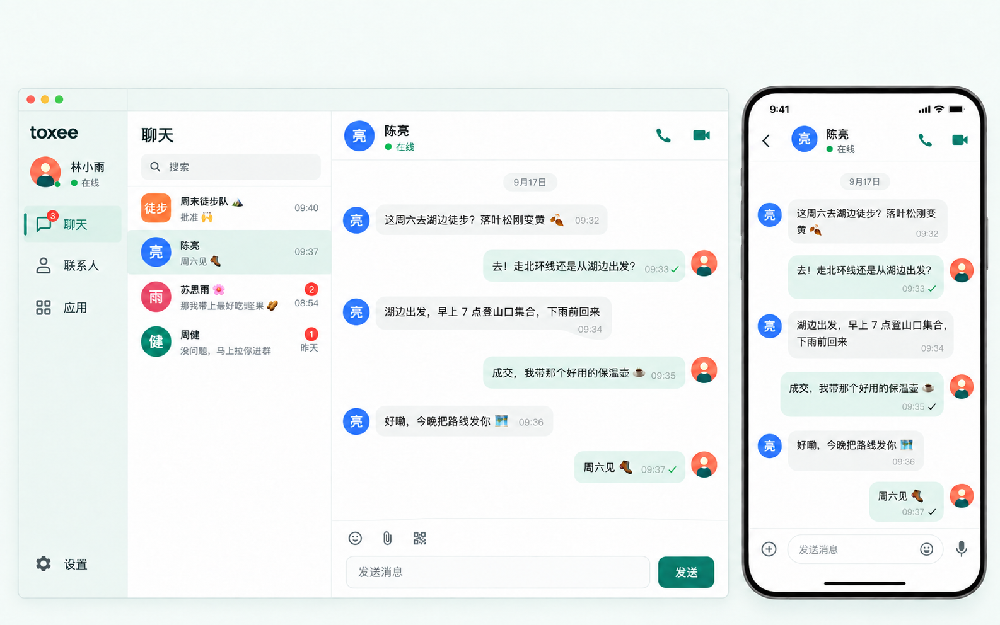
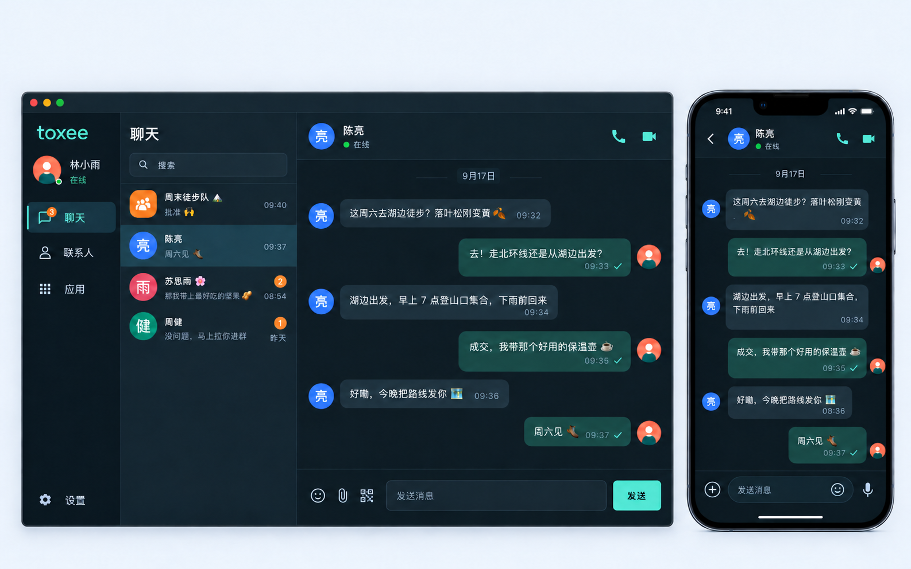
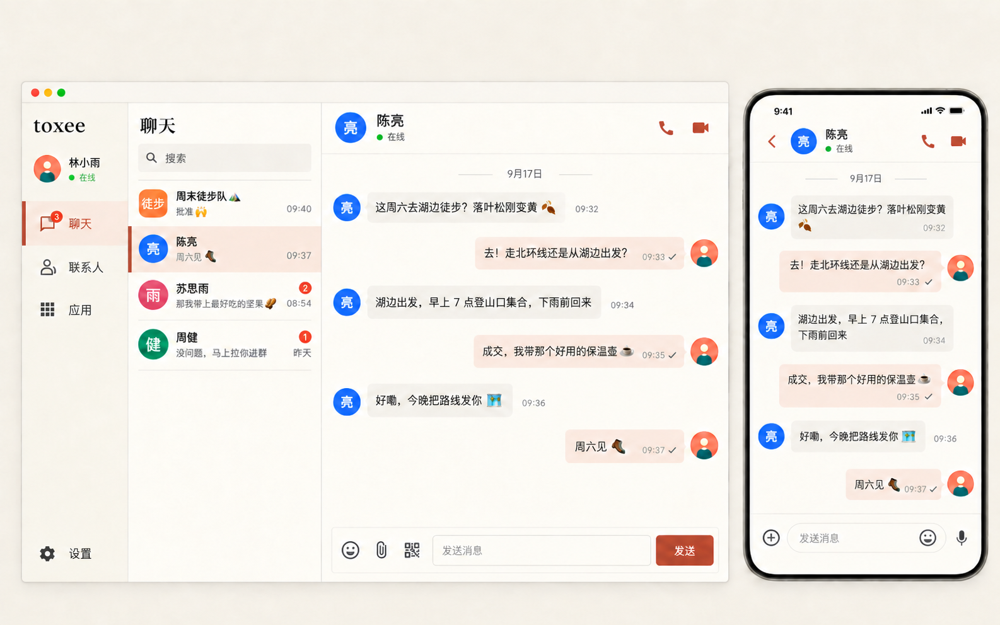
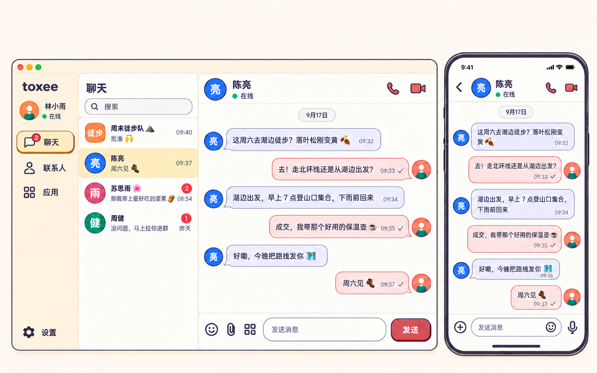
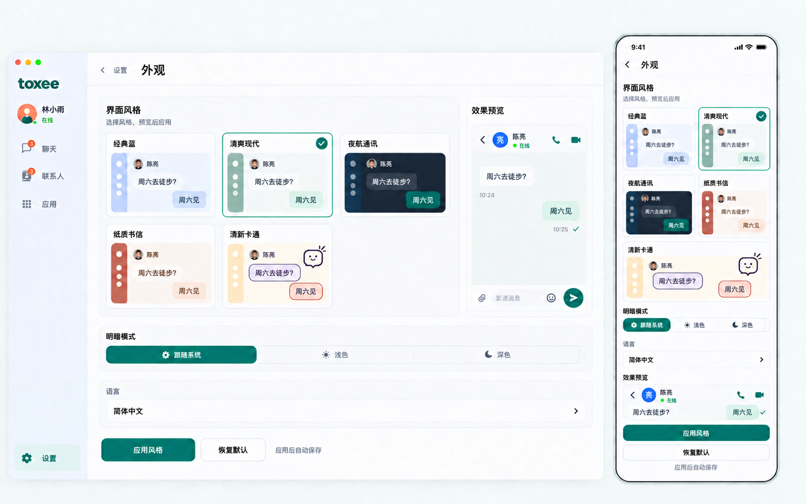

[English](./README.md)

# toxee 多风格界面提案

日期：2026-10-01。状态：已实施到 Flutter；本地验证与实渲染见[实施记录](./implementation.zh-CN.md)。

所有概念设计图已移除界面外上方的方案标题、副标题与标语，包含旧版稿和英文产品图；README 与产品页的中英文素材同步更新。提示词及文件哈希见[标题移除记录](./header-removal.json)。

参考 morsecq 的多风格设计与外观切换方式，为 toxee 提供四套新增视觉方向，保留现有经典蓝作为默认选择。以下设计图由内置 imagegen 生成，是概念设计，不能当作应用运行截图或像素级实施规格。

已同步检查现有布局与交互：[完整审查与优化建议](./layout-interaction-audit.zh-CN.md)。共 8 项，包含文件与行号、现状／建议对照、优先级和验收标准。优先处理好友申请失败后失去重试入口，再改善按钮点击范围、中等宽度三栏布局、输入区、设置层级、次级文字和外观保存反馈。这些改进由四套新风格与经典蓝共用。

根据「清爽现代与清新卡通重复度较高」的反馈，清新卡通已改为第二版轻漫画方向：暖杏底、珊瑚／淡紫气泡、墨紫轮廓和少量实色偏移阴影。清爽现代保持原有视觉方向。两套聊天稿与外观页的区别见[修订说明](./cartoon-v2.zh-CN.md)；旧图移除外围文字后保留为历史，以下展示当前候选稿。

## 风格方向

| 选项 | 视觉语言 | 几何与排版 | 适合的体验 |
| --- | --- | --- | --- |
| 经典蓝 | 保留现有蓝色、白色与灰色界面 | 现有组件规范 | 现有用户的默认选择 |
| A 清爽现代 | 白色、灰绿、深青绿，轻边框 | 中等圆角、紧凑列表、清晰留白 | 日常聊天；推荐的新增方向 |
| B 夜航通讯 | 深蓝灰、薄荷青、少量琥珀 | 小圆角、结构线、等宽时间 | 夜间聊天与长时间使用 |
| C 纸感书信 | 纸白、墨色、陶土红 | 平直分隔、方形面板、编辑式标题 | 安静阅读与较长对话 |
| D 清新卡通 · 第二版 | 暖杏、奶油白、珊瑚、淡紫、墨紫 | 漫画轮廓、胶囊选中项、短偏移实色阴影 | 有明显造型个性的轻松聊天 |

四张聊天稿采用同一位联系人「陈亮」和同一段现有徒步对话，便于比较消息、输入框、头像、会话列表和导航。夜航稿展示深色，其余稿展示浅色；风格与明暗是两个独立维度。

## 概念设计图

## 共用的产品结构

- 主目的地保持「聊天、联系人、应用、设置」四项。群组继续出现在聊天列表和既有联系人功能中。
- 桌面保持主导航、会话列表、聊天内容三栏，沿用真实截图的信息层级。头像区与窗口控制区域留出安全间距。
- 手机单聊、外观页是从主界面推入的独立页面，顶部提供返回，不重复显示主界面底部导航。
- 单聊保留在线文字与状态点、语音／视频通话入口、消息时间和真实发送状态；联系人、群组和 IRC 的可用操作仍遵循各自现有能力。
- 个人头像保持圆形，群组保持圆角方形。未读使用数字；选中项同时使用勾选、边框或指示条。
- 手机保持附件、表情、语音入口与安全区；有输入时显示发送操作。桌面保留现有输入方式、附件、表情和二维码入口。
- 概念稿中的勾选只表示示意的已送达状态。实际实现须映射现有 pending / failed / delivered / read 状态，不把已送达解释成已读。
- 清新卡通的角色只可用于空态或外观缩略图。正常消息区依靠色彩和形状表达亲切感，不添加装饰贴纸、积分、徽章或奖励。

## 外观切换

入口继续使用「设置 → 外观」，保留已有语言设置。

1. 「界面风格」提供经典蓝与四种新增风格；每项有同一聊天场景的缩略图。
2. 「明暗模式」独立提供跟随系统、浅色、深色。夜航风格也支持浅色，其余风格也支持深色。
3. 选择风格或明暗只改变局部效果预览，不更新正在使用的全局外观。
4. 点击「应用风格」后保存；保存成功才更新应用和聊天 UIKit。保存中禁用重复操作；失败保留旧外观、保留待选值并提示重试。
5. 「恢复默认」只暂存经典蓝＋跟随系统，随后仍需点击「应用风格」。离开页面而未应用时丢弃暂存。
6. 风格与明暗按设备保存，与账号切换分离；语言继续使用现有设置流程。
7. 应用外观后保留当前路由、选中会话、聊天草稿、滚动位置、录音／通话和文件传输。切换不得重建这些业务实例。

桌面把选择区与局部预览并列；手机纵向展示。设计稿展示普通字号下的完整构成，大字号或短屏使用页面滚动，并保证应用操作可到达。

## 配色与组件规范

[style-spec.json](./style-spec.json) 保存四套风格的浅深色角色、圆角和文字规范，作为后续实施的建议值；[contrast-checks.json](./contrast-checks.json) 记录候选色值的对比计算。生成图片可能近似色值，实施以规范为准。

| 风格 | 浅色主色／底色 | 深色主色／底色 | 面板／控件／气泡圆角 |
| --- | --- | --- | --- |
| 清爽现代 | `#147D68` / `#F5F8F7` | `#64DAB2` / `#12221C` | 16 / 10 / 14 |
| 夜航通讯 | `#165F6A` / `#F1F5F8` | `#64D8C2` / `#111923` | 8 / 6 / 8 |
| 纸感书信 | `#A34432` / `#F4F0E7` | `#F0A087` / `#231F1A` | 4 / 4 / 6 |
| 清新卡通 | `#B53B50` / `#FFF8EE` | `#FFB2AE` / `#211D2C` | 20 / 12 / 18 |

圆角单位为 Flutter 逻辑像素。正文建议 14–16，必要元数据 12–13，标题 20–24；跟随系统文字缩放。中文正文使用清晰的系统无衬线字体；纸感标题可增加编辑式层级，等宽字体只用于时间或技术 ID。正文区域不使用纸纹理、扫描线、强光、玻璃效果或渐变。

清新卡通额外采用约 2 的轮廓、气泡尾端较小圆角，以及选中导航／主按钮约 2 的实色偏移阴影；正文保持系统字体。清爽现代依靠细边界和留白，纸感书信依靠平直几何和细分隔，各自的造型语言独立。配色、轮廓和阴影均是后续 Flutter 实施规范，生成图会近似这些参数。

正文、必要次级文字、按钮标签和状态文字的目标对比为 4.5:1；必要的可交互轮廓为 3:1。装饰分隔线无需达到控件轮廓的标准。触摸目标至少 44 × 44；状态结合文字／数字／图形表达。减少动态效果时不播放装饰动画，外观过渡不能延迟输入或通话反馈。

## 设计阶段的实施建议

以下保留设计阶段的规划与验收要求；实施状态、实际尺寸及验证范围以[实施记录](./implementation.zh-CN.md)为准。

布局与交互的候选共用规则：中等宽度试验 72 的紧凑导航与 280–300 的会话栏；桌面输入框随内容增长；设置提供直接可达的外观入口；按钮整个可见区域可点击；必要摘要与时间达到文字对比目标。具体断点和控件尺寸须按审查中的实际渲染验收确定，现有概念图尚未逐项表达这些后续调整。

实施先完成申请状态与点击范围等独立修复，再调整共用布局，随后接入多风格和保存反馈；各批单独验收。以上为设计阶段的交付说明；Flutter 实施现已完成。

推荐使用共享风格层，同时映射 Material 与 TencentCloudChat UIKit；实施现采用这一共享风格层。

| 方法 | 优点 | 代价与适用范围 |
| --- | --- | --- |
| 共享主题＋风格 token（推荐） | 统一页面、聊天气泡与设置；可持久化切换 | 需要迁移静态色值，并覆盖 UIKit 色槽和几何 |
| 仅换配色 | 改动较小 | 无法体现纸感与卡通的形状、排版差异 |
| 分别维护四套页面 | 每套自由度高 | 导航、草稿和状态逻辑重复，维护成本高 |

现有接入点：`lib/util/design_tokens.dart`、`lib/util/app_theme_config.dart`、`lib/ui/app_theme_data.dart`、`lib/util/app_component_themes.dart`、`lib/util/appearance_sync.dart`、`lib/util/theme_controller.dart` 和 `lib/ui/settings/global_settings_section.dart`。当前 Material 和 UIKit 是两套主题系统，后续实施必须同步更新；仅修改 `ThemeData` 无法覆盖消息与会话列表。

将配色、面板／控件／气泡几何和语义状态集中定义；桌面导航、联系人／群组、设置、登录、弹窗、搜索和附件等共用此层。保留现有经典蓝的默认值及兼容入口，不在一次视觉修改中改动网络、会话或账号逻辑。

实施验收需覆盖每种风格的浅深色、跟随系统、大字号、窄屏与桌面、语言切换、保存失败、无效历史值、重启恢复、聊天草稿／滚动／通话状态，以及真实发送失败和离线状态。生成设计图不能替代 Flutter 控件渲染和原生设备验证。

## 来源、生成与核验

- 视觉参考：`/Users/bin.gao/.codex/worktrees/ui-styles/morsecq/doc/designs/ui-styles-2026-10-01/`，借鉴多风格对比、几何差异与独立明暗控制。
- 产品基线：[桌面单聊](../../product/assets/zh/desktop/c2c.png)、[手机单聊](../../product/assets/zh/ios/c2c.png)、[桌面设置](../../product/assets/zh/desktop/settings.png)、[手机设置](../../product/assets/zh/ios/settings.png)，以及 `tool/screenshots/seed_data_zh.dart` 的现有演示数据。
- 生成方式：内置 imagegen；完整输入、参考角色和最终提示词记录在 [prompts.json](./prompts.json)。
- 设计阶段 Claude Opus 评审尝试／超时及本地核验记录：[review.md](./review.md)。
- 布局与交互审查：只读观察运行中的 macOS 登录页，结合当前源码与历史桌面／手机／平板截图；已有布局、主题与申请详情测试合计 49 项通过，其中申请失败移除问题在控件测试中复现。未登录账号验证聊天端到端流程，具体证据边界见审查文档。
- 当前交付包含设计图片、规范、审查、Flutter 实施与本地验证，随本地 Git 提交交付；未部署。
